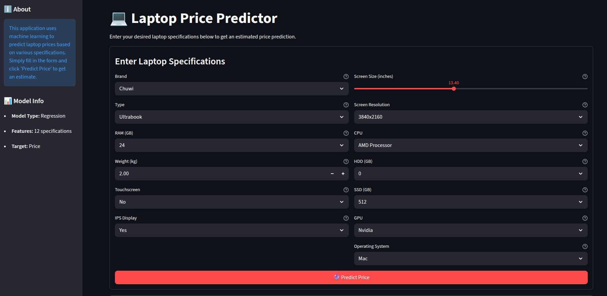
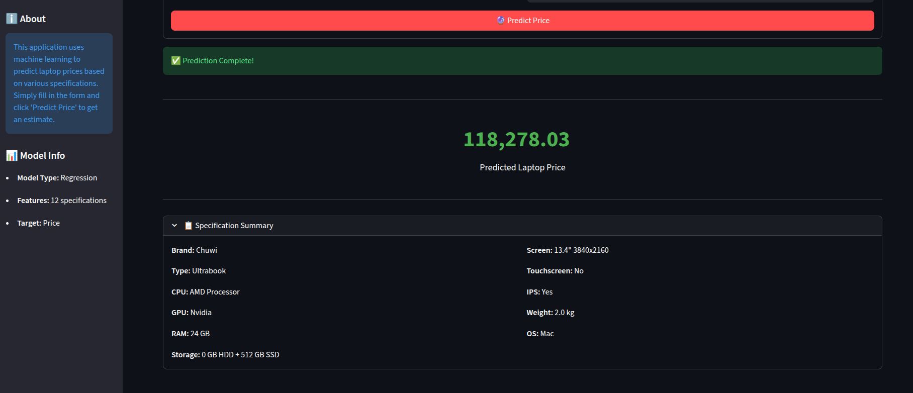

# 💻 Laptop Price Predictor

A machine learning-powered web application that predicts laptop prices based on various specifications. Built with FastAPI backend and Streamlit frontend.

## 🌟 Features

- **Interactive Web Interface**: User-friendly Streamlit interface for inputting laptop specifications
- **RESTful API**: FastAPI backend for predictions and feature options
- **Real-time Predictions**: Instant price predictions based on ML model
- **Comprehensive Specs**: Predict based on 12+ laptop features including:
  - Brand, Type, RAM, Weight
  - Screen Size, Resolution, Touchscreen, IPS Display
  - CPU, GPU, Storage (HDD/SSD)
  - Operating System

## 📸 Screenshots

### Main Interface
<div align="center">


*Clean, intuitive form with dark theme for entering laptop specifications - featuring dropdowns for brand, type, RAM, and sliders for screen size*


*Instant price prediction (₹118,278.03) with expandable specification summary showing all input parameters*

</div>

> **Note**: The application features a modern dark UI with real-time validation and organized input fields for optimal user experience.

## 🏗️ Project Structure

```
laptop_price_prediction/
├── screenshots/               # UI screenshots for documentation
│   ├── input_form.png
│   └── prediction_result.png
├── src/
│   ├── backend/
│   │   ├── api.py                 # FastAPI application
│   │   ├── schema.py              # Pydantic models
│   │   ├── prediction_services.py # Prediction logic
│   │   ├── model_loader.py        # Model loading utilities
│   │   ├── config.py              # Configuration constants
│   │   ├── pipe.pkl               # Trained ML pipeline
│   │   └── df.pkl                 # Feature reference data
│   └── ui/
│       └── app.py                 # Streamlit application
├── .venv/                     # Virtual environment (not in git)
├── requirements.txt           # Python dependencies
├── .gitignore                 # Git ignore file
└── README.md                  # Project documentation              
```

## 🚀 Getting Started

### Prerequisites

- Python 3.12+
- pip (Python package manager)

### Installation

1. **Clone the repository**
   ```bash
   git clone https://github.com/Itsyunish/laptop-price-prediction.git
   cd laptop_price_prediction
   ```

2. **Create virtual environment**
   ```bash
   python -m venv .venv
   source .venv/bin/activate  # On Windows: .venv\Scripts\activate
   ```

3. **Install dependencies**
   ```bash
   pip install -r requirements.txt
   ```

### Running the Application

#### Option 1: Full Stack (FastAPI + Streamlit)

1. **Start the FastAPI backend** (Terminal 1)
   ```bash
   uvicorn src.backend.api:app --reload --host 0.0.0.0 --port 8000
   ```

2. **Start the Streamlit frontend** (Terminal 2)
   ```bash
   streamlit run src/ui/app.py
   ```

3. **Access the application**
   - Frontend: http://localhost:8501
   - API Docs: http://localhost:8000/docs

#### Option 2: Direct Prediction (Backend Only)

```bash
python -m src.backend.prediction_services
```

## 📡 API Endpoints

### `GET /`
Health check endpoint
- **Response**: `{"message": "Laptop Price Prediction API"}`

### `GET /health`
API health status
- **Response**: `{"status": "healthy"}`

### `GET /features`
Get available feature options
- **Response**: Lists of companies, types, CPUs, GPUs, and OS options

### `POST /predict`
Predict laptop price
- **Request Body**:
  ```json
  {
    "company": "Dell",
    "type": "Notebook",
    "ram": 8,
    "weight": 1.5,
    "touchscreen": "No",
    "ips": "Yes",
    "screen_size": 15.6,
    "resolution": "1920x1080",
    "cpu": "Intel",
    "hdd": 0,
    "ssd": 256,
    "gpu": "Intel",
    "os": "Windows"
  }
  ```
- **Response**:
  ```json
  {
    "predicted_price": 45000.50,
    "currency": "INR",
    "specifications": { ... }
  }
  ```

## 🛠️ Technologies Used

### Backend
- **FastAPI**: Modern web framework for building APIs
- **Pydantic**: Data validation and settings management
- **scikit-learn**: Machine learning pipeline
- **pandas**: Data manipulation
- **numpy**: Numerical computing

### Frontend
- **Streamlit**: Interactive web application framework
- **Requests**: HTTP library for API calls

### Development
- **Uvicorn**: ASGI server
- **Python 3.12**: Programming language

## 📊 Model Information

- **Model Type**: Regression
- **Features**: 12 laptop specifications
- **Target**: Price (INR)
- **Pipeline**: Preprocessing + ML Model stored in `pipe.pkl`

## 🎯 Usage Example

### Using the Web Interface

1. **Open the Streamlit application** at http://localhost:8501
2. **Fill in the laptop specifications:**
   - **Brand**: Choose from Chuwi, Dell, HP, Lenovo, Apple, etc.
   - **Type**: Select Ultrabook, Notebook, Gaming, Workstation, or 2-in-1 Convertible
   - **RAM**: Configure from 2GB to 64GB
   - **Weight**: Enter laptop weight in kg
   - **Screen**: Set size (10"-18") and resolution (up to 4K)
   - **Storage**: Choose HDD and SSD capacities
   - **Components**: Select CPU (Intel/AMD), GPU (Intel/AMD/Nvidia)
   - **OS**: Pick Windows, Mac, Linux, or DOS
3. **Click "🔮 Predict Price"**
4. **View results**: 
   - Price displayed prominently in INR
   - Expandable specification summary for review
   - Success confirmation message

### Example Prediction
**Input**: Chuwi Ultrabook with 24GB RAM, 13.4" 4K display, AMD CPU, Nvidia GPU, 512GB SSD
**Output**: ₹118,278.03

## 🔧 Configuration

Edit `src/backend/config.py` to modify:
- Available RAM options
- Storage options (HDD/SSD)
- Screen resolutions
- Valid screen size ranges

## 📝 API Documentation

Interactive API documentation is available at:
- **Swagger UI**: http://localhost:8000/docs
- **ReDoc**: http://localhost:8000/redoc

## Troubleshooting

### FastAPI server not starting
- Ensure port 8000 is not in use
- Check if virtual environment is activated
- Verify all dependencies are installed

### Streamlit connection error
- Ensure FastAPI backend is running on port 8000
- Check network connectivity to localhost

### Validation errors
- Ensure all required fields are provided
- Check field types match the schema
- Verify RAM/storage values are from allowed options

## Acknowledgments
- Dataset source: https://www.kaggle.com/code/nehahatti/laptop-price-prediction/input
- Inspired by laptop price prediction use cases
- Built with modern Python web frameworks 
